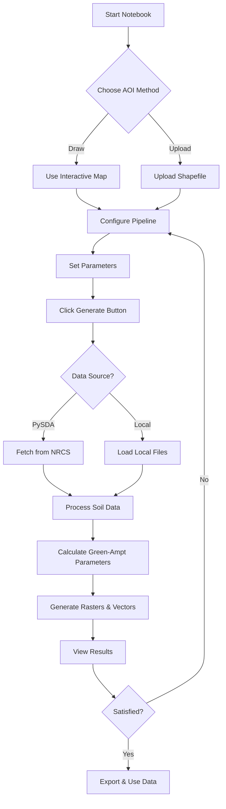

# Jupyter Notebook Interface Guide

## Overview

The `green_ampt_notebook.ipynb` provides an interactive, user-friendly interface for generating Green-Ampt infiltration parameters from SSURGO soil data.

## Notebook Sections

### 1. Setup Cell
**What it does:** Imports all required libraries and initializes the system.

**Expected output:**
```
✓ Libraries imported successfully
```

### 2. Interactive Map (AOI Drawing)
**What it does:** Displays an interactive map centered on the United States with drawing tools.

**Features:**
- **Map Controls:** Zoom, pan, and layer selection
- **Drawing Tools (left side):**
  - 🔷 Polygon tool - Draw custom polygons
  - ⬜ Rectangle tool - Draw rectangular areas
  - 🗑️ Delete tool - Remove drawn shapes

**User Actions:**
1. Navigate to your area of interest
2. Select the polygon or rectangle tool
3. Click on the map to draw your AOI
4. See confirmation: "✓ AOI created: Polygon"

**Visual Description:**
```
+----------------------------------------------------------+
|  Draw your Area of Interest                              |
|  Use the drawing tools to draw a polygon or rectangle    |
+----------------------------------------------------------+
|  [Drawing Tools]                                         |
|  |📍|  🔷  ⬜  🗑️       [+] [-]  [Layers]               |
|  |                                                       |
|  |                                                       |
|  |          [Interactive OpenStreetMap]                  |
|  |                                                       |
|  |              ┌─────────┐                              |
|  |              │ Drawn   │  ← User-drawn AOI            |
|  |              │  AOI    │                              |
|  |              └─────────┘                              |
|  |                                                       |
+----------------------------------------------------------+
Output: ✓ AOI created: Polygon
        Ready to proceed to the next step!
```

### 3. Shapefile Upload (Alternative AOI Input)
**What it does:** Allows users to upload existing vector files instead of drawing.

**Supported formats:**
- Shapefile (.shp + .shx + .dbf + .prj)
- GeoPackage (.gpkg)
- GeoJSON (.geojson)
- Zipped shapefiles (.zip)

**Visual Description:**
```
+----------------------------------------------------------+
| Or upload an existing shapefile:                         |
+----------------------------------------------------------+
| [Choose Files]  No file chosen                           |
|                                                           |
| [ Load Shapefile ]  ← Click after selecting files        |
+----------------------------------------------------------+
Output:   Saved: test_aoi.shp
          Saved: test_aoi.shx
          Saved: test_aoi.dbf
          Saved: test_aoi.prj
        ✓ Loaded 1 feature(s) from test_aoi.shp
          CRS: EPSG:4326
        ✓ AOI loaded and displayed on map
          Ready to proceed to the next step!
```

### 4. Pipeline Configuration
**What it does:** Provides interactive widgets to configure the analysis parameters.

**Visual Description:**
```
+----------------------------------------------------------+
| Pipeline Configuration:                                  |
+----------------------------------------------------------+
| Data Source:      [pysda ▼]                             |
| Output Dir:       [./outputs                        ]    |
| Output CRS:       [EPSG:32617                       ]    |
| Resolution (m):   [30.0                             ]    |
| Depth Limit (cm): [30.0                             ]    |
| ☑ Export raw SSURGO data                                |
+----------------------------------------------------------+
```

**Configuration Options:**

| Widget | Description | Default |
|--------|-------------|---------|
| Data Source | pysda (online) or local (files) | pysda |
| Output Dir | Where results are saved | ./outputs |
| Output CRS | Coordinate system for rasters | EPSG:32617 |
| Resolution | Pixel size in meters | 30.0 |
| Depth Limit | Soil depth considered (cm) | 30.0 |
| Export raw data | Save original SSURGO files | Checked |

**When "local" is selected:**
```
+----------------------------------------------------------+
| Mupolygon:  [path/to/mupolygon.shp                  ]   |
| Mapunit:    [path/to/mapunit.txt                    ]   |
| Component:  [path/to/component.txt                  ]   |
| Chorizon:   [path/to/chorizon.txt                   ]   |
+----------------------------------------------------------+
```

### 5. Pipeline Execution
**What it does:** Runs the Green-Ampt parameter generation workflow.

**Visual Description:**
```
+----------------------------------------------------------+
| Execute Pipeline:                                        |
+----------------------------------------------------------+
| [ ▶ Generate Green-Ampt Parameters ]                    |
+----------------------------------------------------------+
Output:
Starting pipeline with AOI from: drawn
============================================================
✓ AOI saved to temporary file: /tmp/.../aoi.geojson
✓ Configuration created
  Output directory: /home/user/outputs
  Data source: pysda
  Resolution: 30.0 m
  CRS: EPSG:32617

Running pipeline...
INFO - Starting Green-Ampt pipeline
INFO - Fetching SSURGO data using PySDA
INFO - Clipping mupolygon to AOI bounds
INFO - Summarising soil properties (depth_limit_cm=30.0)
INFO - Attaching aggregated properties to spatial data
INFO - Vector parameters saved to /home/user/outputs/vectors/...
INFO - Rasterising parameters
INFO - Pipeline complete; rasters written to /home/user/outputs/rasters

============================================================
✓ Pipeline completed successfully!
  Rasters: /home/user/outputs/rasters
  Vectors: /home/user/outputs/vectors
  Raw data: /home/user/outputs/raw_data
```

### 6. Results Visualization (Optional)
**What it does:** Displays the generated parameter rasters in a 2x2 grid.

**Usage:**
Uncomment the last line and run:
```python
visualize_results(output_dir_widget.value)
```

**Visual Description:**
```
+----------------------------------------------------------+
|  ksat                          theta_s                   |
|  (min: 0.52, max: 15.8)       (min: 0.35, max: 0.48)    |
|  [Viridis colormap]            [Viridis colormap]        |
|                                                          |
+---------------------------+------------------------------+
|  psi                           theta_i                   |
|  (min: 5.2, max: 35.6)        (min: 0.15, max: 0.25)    |
|  [Viridis colormap]            [Viridis colormap]        |
|                                                          |
+----------------------------------------------------------+
```

## Workflow Summary



## Key Advantages

1. **No Command Line Required:** All interactions through visual widgets
2. **Interactive Map:** Easy AOI selection with visual feedback
3. **Flexible Input:** Draw or upload AOI
4. **Real-time Configuration:** Adjust settings without editing code
5. **Progress Monitoring:** See detailed logging output
6. **Visualization:** Preview results within the notebook
7. **Iterative Workflow:** Easy to rerun with different parameters

## Output Files

After successful execution, find your results in:

```
outputs/
├── rasters/
│   ├── ksat_green_ampt.tif       # Hydraulic conductivity
│   ├── theta_s_green_ampt.tif    # Saturated water content
│   ├── psi_green_ampt.tif        # Wetting front suction
│   └── theta_i_green_ampt.tif    # Initial water content
├── vectors/
│   └── green_ampt_params.shp     # All parameters as shapefile
└── raw_data/                      # (if export enabled)
    ├── mupolygon_raw/            # Original SSURGO spatial data
    └── *.txt                      # Original SSURGO tabular data
```

## Common Notebook Patterns

### Pattern 1: Quick Test with Small AOI
1. Draw a small rectangle on the map
2. Keep default settings
3. Use PySDA data source
4. Click Generate

### Pattern 2: Production Run with Custom Settings
1. Upload project boundary shapefile
2. Set appropriate output CRS for your region
3. Adjust resolution (e.g., 10m for detailed, 100m for regional)
4. Configure depth limit based on your model needs
5. Enable raw data export for archival
6. Click Generate

### Pattern 3: Comparing Different Parameters
1. Define AOI once (draw or upload)
2. Run with depth_limit_cm=30
3. Note the results location
4. Change depth_limit_cm=60
5. Run again
6. Compare the outputs in GIS software

## Tips for Success

- **Start with a small AOI** to test before processing large areas
- **Check your CRS** - EPSG:32617 is for eastern US (UTM Zone 17N)
- **Monitor memory** - Very large AOIs may require chunking
- **Save your work** - The notebook auto-saves, but manually save important configurations
- **Document parameters** - Add markdown cells to record your analysis decisions

## Next Steps

After mastering the notebook:
1. Explore the CLI version for automation: `green_ampt.py`
2. Read the detailed user guide: `docs/user_guide.md`
3. Review the code modules in `green_ampt_tool/` for customization
4. Integrate outputs into your hydrologic models
